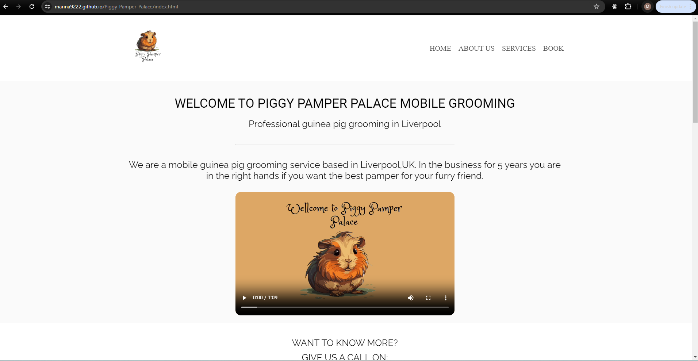
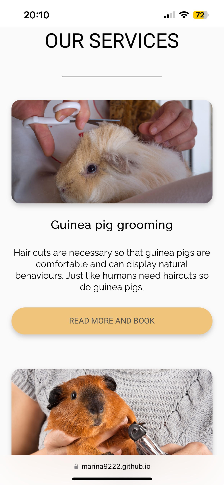
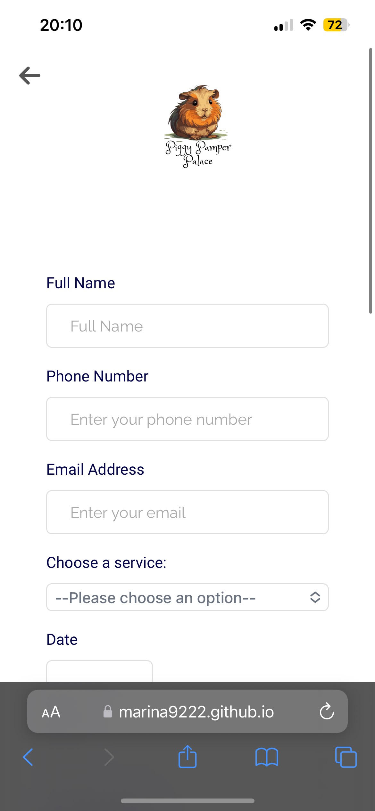
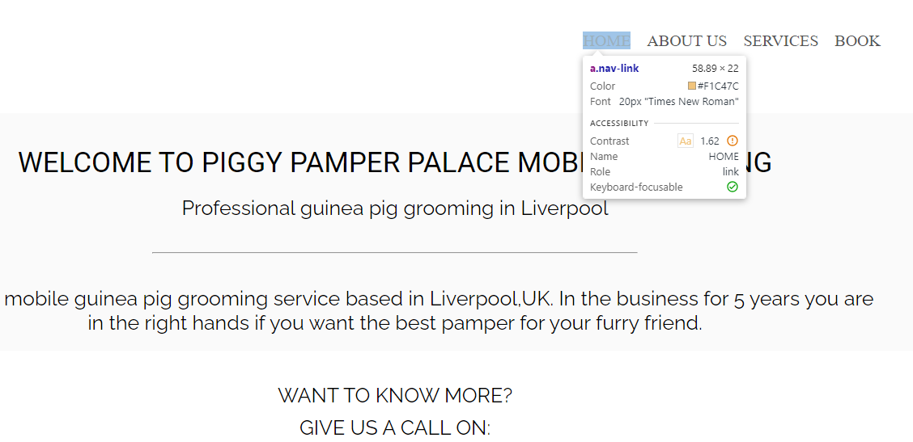

# Testing

Return back to the [README.md](README.md) file.

## Code Validation

### HTML

I have used the recommended [HTML W3C Validator](https://validator.w3.org) to validate all of my HTML files.

| Page          | W3C URL                                                                                                               | Screenshot                                                     | Notes |
| ------------- | --------------------------------------------------------------------------------------------------------------------- | -------------------------------------------------------------- | ----- |
| Home          | [W3C](https://validator.w3.org/nu/?doc=https%3A%2F%2Fmarina9222.github.io%2FPiggy-Pamper-Palace%2Findex.html)         |           | Pass  |
| Form          | [W3C](https://validator.w3.org/nu/?doc=https%3A%2F%2Fmarina9222.github.io%2FPiggy-Pamper-Palace%2Fform.html)          |           | Pass  |
| Grooming      | [W3C](https://validator.w3.org/nu/?doc=https%3A%2F%2Fmarina9222.github.io%2FPiggy-Pamper-Palace%2Fgrooming.html)      |       | Pass  |
| Nail-clipping | [W3C](https://validator.w3.org/nu/?doc=https%3A%2F%2Fmarina9222.github.io%2FPiggy-Pamper-Palace%2Fnail-clipping.html) |  | Pass  |
| Baths         | [W3C](https://validator.w3.org/nu/?doc=https%3A%2F%2Fmarina9222.github.io%2FPiggy-Pamper-Palace%2Fbaths.html)         |          | Pass  |
| Full package  | [W3C](https://validator.w3.org/nu/?doc=https%3A%2F%2Fmarina9222.github.io%2FPiggy-Pamper-Palace%2Ffull-package.html)  |   | Pass  |

### CSS

I have used the recommended [CSS Jigsaw Validator](https://jigsaw.w3.org/css-validator) to validate all of my CSS files.

| File      | Jigsaw URL                                                                                                           | Screenshot                                      | Notes                                                        |
| --------- | -------------------------------------------------------------------------------------------------------------------- | ----------------------------------------------- | ------------------------------------------------------------ |
| style.css | [Jigsaw](https://jigsaw.w3.org/css-validator/validator?uri=https%3A%2F%2Fmarina9222.github.io%2FPiggy-Pamper-Palace) |  | Pass: No Errors of my CSS , showing Errors with Font Awesome |

## Browser Compatibility

| Browser | Home                                                  | Form                                                  | Grooming                                                  | Nail-clipping                                                  | Baths                                                  | Full package                                                  | Confirmation                                                  | Notes             |
| ------- | ----------------------------------------------------- | ----------------------------------------------------- | --------------------------------------------------------- | -------------------------------------------------------------- | ------------------------------------------------------ | ------------------------------------------------------------- | ------------------------------------------------------------- | ----------------- |
| Chrome  |   |   |   |   |   |   |   | Works as expected |
| Opera   |    |    |    |    |    |    |    | Works as expected |
| Firefox |  |  |  |  |  |  |  | Works as expected |

## Responsiveness

I've tested my deployed project on multiple devices to check for responsiveness issues.

| Device            | Home                                                | Call us                                                | Our services                                                | Book                                                | Baths                                                | Nail clipping                                                | Full package                                                | Grooming                                                | Confirmation                                                | Notes             |
| ----------------- | --------------------------------------------------- | ------------------------------------------------------ | ----------------------------------------------------------- | --------------------------------------------------- | ---------------------------------------------------- | ------------------------------------------------------------ | ----------------------------------------------------------- | ------------------------------------------------------- | ----------------------------------------------------------- | ----------------- |
| Mobile (DevTools) |    |    |    |    |    |    |    |    |    | Works as expected |
| Tablet (DevTools) |    |    |    |    |    |    |    |    |    | Works as expected |
| Dekstop           |   |   |   |   |   |   |   |   |   | Works as expected |
| Iphone 13         |  |  |  |  |  |  |  |  |  | Works as expected |

## Lighthouse Audit

I've tested my deployed project using the Lighthouse Audit tool to check for any major issues.

| Page          | Mobile                                                           | Desktop                                                           | Notes                                  |
| ------------- | ---------------------------------------------------------------- | ----------------------------------------------------------------- | -------------------------------------- |
| Home          |           |           | Some minor warnings                    |
| Book          |           |           | Some minor warnings                    |
| Grooming      |       |       | Some minor warnings                    |
| Nail clipping |  |  | Slow response time due to large images |
| Baths         |          |          | Slow response time due to large images |
| Full package  |   |   | Slow response time due to large images |
| Confirmation  |   |   | Some minor warnings                    |

## Bugs

- The buttons in the our services section werent aligned.

- To fix this, I added display:flex , justify-content:space-between and flex-direction:column to the .card.

- The carousel text color was white and as the background images have a lot of white as well made the text not so visible.

- To fix this, I have added the following data-bs-theme="dark" in the main wrapper of the carousel so it could change the text color to dark and be more visible.

- The footer in the nail clipping section wasnt covering the full width in the dekstop view.

  

  - To fix this, I have added the container fluid class in the footer.

- The color on hover in the nav bar had a low contrast.

- To fix this, I found a similar color with more contrast.

- The arrow on the top left of the nail clipping section wasn't at the same place as the arrow in the other sections.

  

  - To fix this, I had to change the class container in the header section to nail-clipping-container as container was already used with a bootstrap on the page and had already made styles.

## Unfixed Bugs

- In the our services section the title of each card has a blank space on top and is not aligned with the other card's titles.

  

  - Attempted fix: I tried to remove the gap between the text , I tried to remove the justify content :space-between, tried to change the widths of the cards , of the card's image nothing would fix it.
