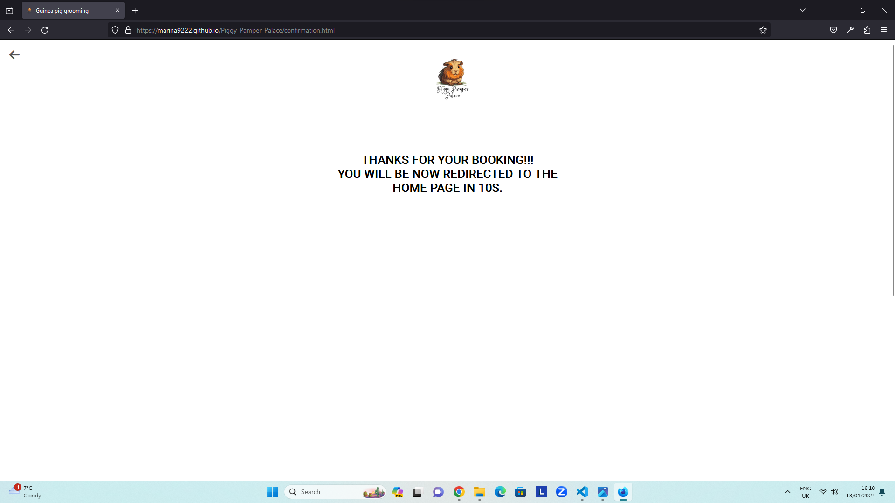

# Testing

Return back to the [README.md](README.md) file.

## Code Validation

### HTML

I have used the recommended [HTML W3C Validator](https://validator.w3.org) to validate all of my HTML files.

| Page          | W3C URL                                                                                                               | Screenshot                                                     | Notes |
| ------------- | --------------------------------------------------------------------------------------------------------------------- | -------------------------------------------------------------- | ----- |
| Home          | [W3C](https://validator.w3.org/nu/?doc=https%3A%2F%2Fmarina9222.github.io%2FPiggy-Pamper-Palace%2Findex.html)         |           | Pass  |
| Form          | [W3C](https://validator.w3.org/nu/?doc=https%3A%2F%2Fmarina9222.github.io%2FPiggy-Pamper-Palace%2Fform.html)          |           | Pass  |
| Grooming      | [W3C](https://validator.w3.org/nu/?doc=https%3A%2F%2Fmarina9222.github.io%2FPiggy-Pamper-Palace%2Fgrooming.html)      |       | Pass  |
| Nail-clipping | [W3C](https://validator.w3.org/nu/?doc=https%3A%2F%2Fmarina9222.github.io%2FPiggy-Pamper-Palace%2Fnail-clipping.html) |  | Pass  |
| Baths         | [W3C](https://validator.w3.org/nu/?doc=https%3A%2F%2Fmarina9222.github.io%2FPiggy-Pamper-Palace%2Fbaths.html)         |          | Pass  |
| Full package  | [W3C](https://validator.w3.org/nu/?doc=https%3A%2F%2Fmarina9222.github.io%2FPiggy-Pamper-Palace%2Ffull-package.html)  |   | Pass  |

### CSS

I have used the recommended [CSS Jigsaw Validator](https://jigsaw.w3.org/css-validator) to validate all of my CSS files.

<!-- | File      | Jigsaw URL                                                                                                           | Screenshot                                            | Notes           |
| --------- | -------------------------------------------------------------------------------------------------------------------- | ----------------------------------------------------- | --------------- |
| style.css | [Jigsaw](https://jigsaw.w3.org/css-validator/validator?uri=https%3A%2F%2Fmarina9222.github.io%2FPiggy-Pamper-Palace) |  | Pass: No Errors | -->

## Browser Compatibility

| Browser | Home                                                  | Form                                                  | Grooming                                                  | Nail-clipping                                                  | Baths                                                  | Full package                                                  | Confirmation                                                  | Notes             |
| ------- | ----------------------------------------------------- | ----------------------------------------------------- | --------------------------------------------------------- | -------------------------------------------------------------- | ------------------------------------------------------ | ------------------------------------------------------------- | ------------------------------------------------------------- | ----------------- |
| Chrome  |   |   |   |   |   |   |   | Works as expected |
| Opera   |    |    |    |    |    |    |    | Works as expected |
| Firefox |  |  |  |  |  |  |  | Works as expected |
